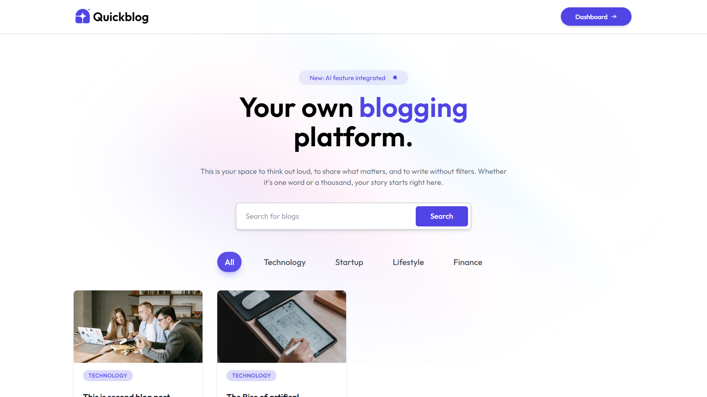
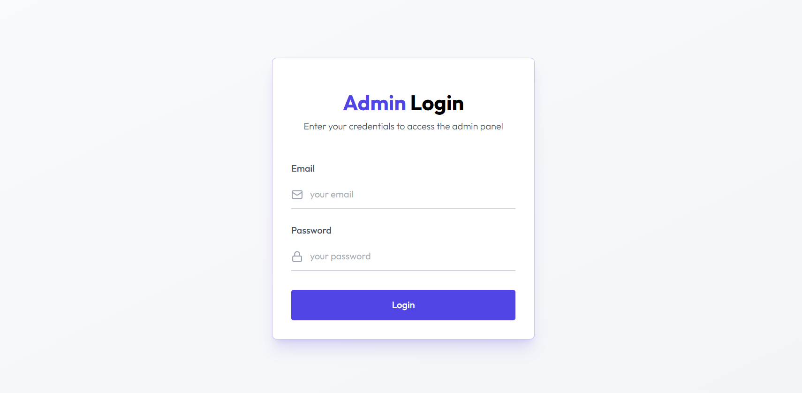
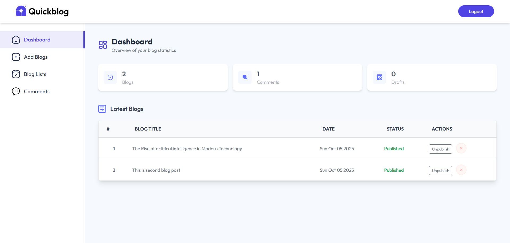
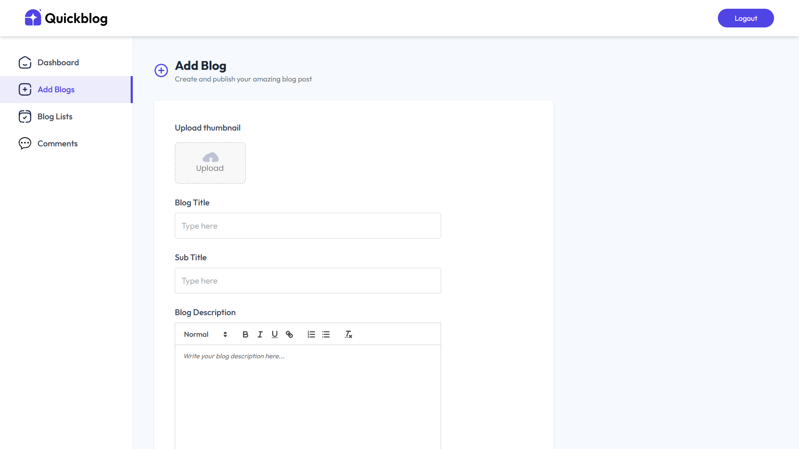
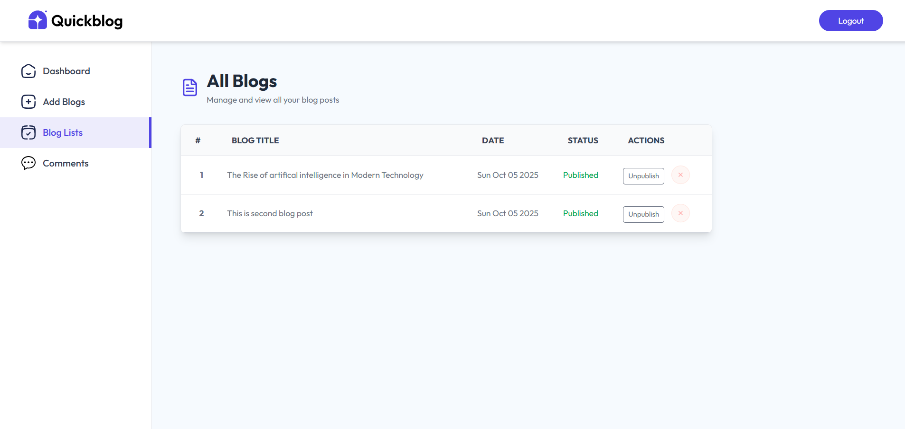
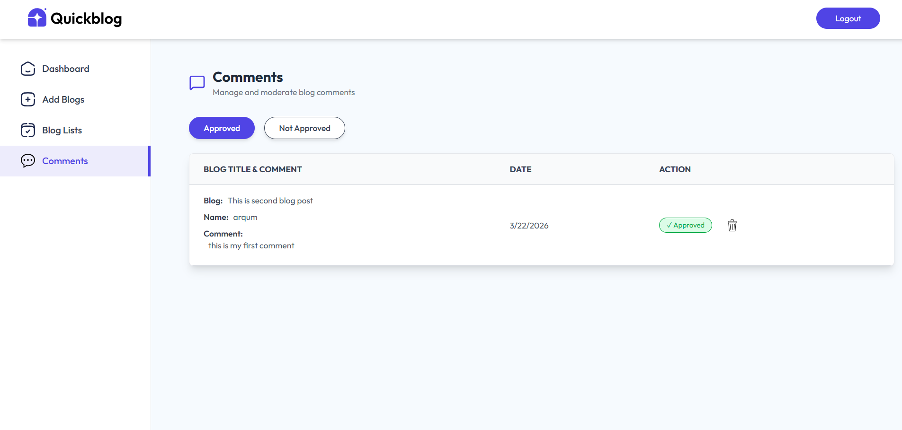

# 📝 MERN Stack Blog Platform

A modern, full-featured blogging platform built with the MERN stack (MongoDB, Express.js, React, Node.js). This platform provides a seamless experience for creating, managing, and publishing blog posts with an intuitive admin dashboard and AI-powered content generation..


## ✨ Features

### Frontend
- 🎨 **Modern UI/UX**: Fully responsive design with Tailwind CSS
- 📱 **Mobile-First**: Optimized for all devices (mobile, tablet, desktop)
- 🔍 **Search Functionality**: Real-time blog search by title and category
- 📂 **Category Filtering**: Filter blogs by categories with smooth animations
- 💬 **Comment System**: Interactive commenting with approval workflow
- 📧 **Newsletter Subscription**: Email subscription for latest updates
- 🎯 **Dynamic Routing**: Fast navigation with React Router

### Admin Panel
- 🔐 **Secure Authentication**: JWT-based admin login system
- ✍️ **Rich Text Editor**: Quill.js integration for beautiful blog formatting
- 🤖 **AI Content Generation**: Generate blog content using AI
- 📊 **Dashboard Analytics**: View blogs, comments, and drafts statistics
- 📝 **Blog Management**: Create, edit, delete, and publish/unpublish blogs
- 💭 **Comment Moderation**: Approve or reject user comments
- 🖼️ **Image Upload**: Upload and manage blog thumbnails
- 📋 **Draft System**: Save blogs as drafts before publishing

### Technical Features
- ⚡ **Fast Performance**: Optimized React components with hooks
- 🔄 **Real-time Updates**: Instant UI updates after CRUD operations
- 🎭 **Smooth Animations**: Framer Motion for elegant transitions
- 🔔 **Toast Notifications**: React Hot Toast for user feedback
- 🎨 **Icons**: Lucide React for beautiful, customizable icons
- 📦 **State Management**: React Context API for global state

  

## 📸 Screenshots

### Homepage


### Login Page


### Admin Dashboard


### Add Blog


### Blog List


### Comments Management



## 🚀 Tech Stack

### Frontend
- **React** 18.x - UI library
- **Tailwind CSS** - Utility-first CSS framework
- **React Router DOM** - Client-side routing
- **Axios** - HTTP client
- **Quill.js** - Rich text editor
- **React Hot Toast** - Toast notifications
- **Lucide React** - Icon library

### Backend
- **Node.js** - Runtime environment
- **Express.js** - Web framework
- **MongoDB** - NoSQL database
- **Mongoose** - MongoDB object modeling
- **JWT** - Authentication
- **Bcrypt** - Password hashing
- **Multer** - File upload handling
- **Cloudinary** - Image storage (optional)

## 📋 Prerequisites

Before running this project, make sure you have:

- **Node.js** (v18 or higher)
- **MongoDB** (v6 or higher)
- **npm** or **yarn** package manager

## ⚙️ Installation

### 1. Clone the repository

```bash
git clone https://github.com/ARQUM21/mern-stack-blog-platform.git
cd mern-stack-blog-platform
```

### 2. Install Backend Dependencies

```bash
cd server
npm install
```

### 3. Install Frontend Dependencies

```bash
cd ../client
npm install
```

### 4. Environment Variables

Create a `.env` file in the `server` directory:

```env
# Database
MONGODB_URI=mongodb://localhost:27017/blog-platform

# JWT Secret
JWT_SECRET=your_super_secret_jwt_key_here

# Admin Credentials
ADMIN_EMAIL=admin@example.com
ADMIN_PASSWORD=your_admin_password

# AI API (Optional)
OPENAI_API_KEY=your_openai_api_key

# Cloudinary (Optional - for image uploads)
CLOUDINARY_CLOUD_NAME=your_cloud_name
CLOUDINARY_API_KEY=your_api_key
CLOUDINARY_API_SECRET=your_api_secret
```

Create a `.env` file in the `client` directory:

```env
VITE_API_URL=http://localhost:5000
```

## 🎯 Running the Application

### Development Mode

**Start Backend Server:**
```bash
cd server
npm run dev
```

**Start Frontend Development Server:**
```bash
cd client
npm run dev
```

The application will be available at:
- Frontend: `http://localhost:5173`
- Backend API: `http://localhost:5000`

### Production Build

**Build Frontend:**
```bash
cd client
npm run build
```

**Start Production Server:**
```bash
cd server
npm start
```

## 📁 Project Structure

```
mern-stack-blog-platform/
├── client/                    # Frontend React application
│   ├── public/               # Static files
│   ├── src/
│   │   ├── assets/          # Images, icons, data
│   │   ├── components/      # React components
│   │   │   ├── admin/      # Admin components
│   │   │   └── ...         # Other components
│   │   ├── context/        # React Context API
│   │   ├── pages/          # Page components
│   │   │   ├── admin/     # Admin pages
│   │   │   └── ...        # Public pages
│   │   ├── App.jsx        # Main app component
│   │   └── main.jsx       # Entry point
│   ├── index.html
│   ├── package.json
│   └── tailwind.config.js
│
├── server/                   # Backend Node.js application
│   ├── config/             # Configuration files
│   ├── controllers/        # Route controllers
│   ├── models/            # Mongoose models
│   ├── routes/            # API routes
│   ├── middleware/        # Custom middleware
│   ├── utils/             # Utility functions
│   ├── uploads/           # Uploaded files
│   ├── server.js          # Entry point
│   └── package.json
│
└── README.md
```

## 🔑 API Endpoints

### Public Routes
- `GET /api/blogs` - Get all published blogs
- `GET /api/blog/:id` - Get single blog by ID
- `POST /api/comment` - Add comment to blog
- `POST /api/subscribe` - Subscribe to newsletter

### Admin Routes (Protected)
- `POST /api/admin/login` - Admin login
- `GET /api/admin/dashboard` - Get dashboard statistics
- `POST /api/admin/blog/add` - Create new blog
- `PUT /api/admin/blog/:id` - Update blog
- `DELETE /api/admin/blog/:id` - Delete blog
- `GET /api/admin/comments` - Get all comments
- `PUT /api/admin/comment/:id` - Approve/reject comment
- `POST /api/admin/generate` - Generate blog content with AI

## 🎨 Key Features Explanation

### Responsive Design
All pages are fully responsive and optimized for:
- **Mobile** (320px - 640px)
- **Tablet** (640px - 1024px)
- **Desktop** (1024px+)

### AI Content Generation
- Uses OpenAI API to generate blog content
- Based on blog title prompt
- Parses markdown to HTML using Marked.js
- Integrated directly into the blog editor

### Admin Dashboard
- Real-time statistics (total blogs, comments, drafts)
- Recent blogs table with actions
- Quick access to all admin features

### Comment Moderation
- Comments require admin approval before display
- Filter by approved/not approved status
- Easy approve/reject actions

## 🔒 Security Features

- ✅ JWT-based authentication
- ✅ Password hashing with bcrypt
- ✅ Protected admin routes
- ✅ Input validation and sanitization
- ✅ CORS configuration
- ✅ Rate limiting (recommended for production)


## 🤝 Contributing

Contributions are welcome! Please follow these steps:

1. Fork the repository
2. Create a new branch (`git checkout -b feature/amazing-feature`)
3. Commit your changes (`git commit -m 'Add some amazing feature'`)
4. Push to the branch (`git push origin feature/amazing-feature`)
5. Open a Pull Request

## 📄 License

This project is licensed under the MIT License - see the [LICENSE](LICENSE) file for details.

## 👨‍💻 Author

**Muhammad Arqum Tariq**

[](https://github.com/ARQUM21)
[](https://www.linkedin.com/in/muhammadarqumtariq/)
[](mailto:marqum987@gmail.com)


## 🙏 Acknowledgments

- React team for the amazing library
- Tailwind CSS for the utility-first CSS framework
- MongoDB team for the excellent database
- OpenAI for AI content generation capabilities
- All open-source contributors

---

⭐ If you found this project helpful, please give it a star!

**Happy Blogging! 🎉**
